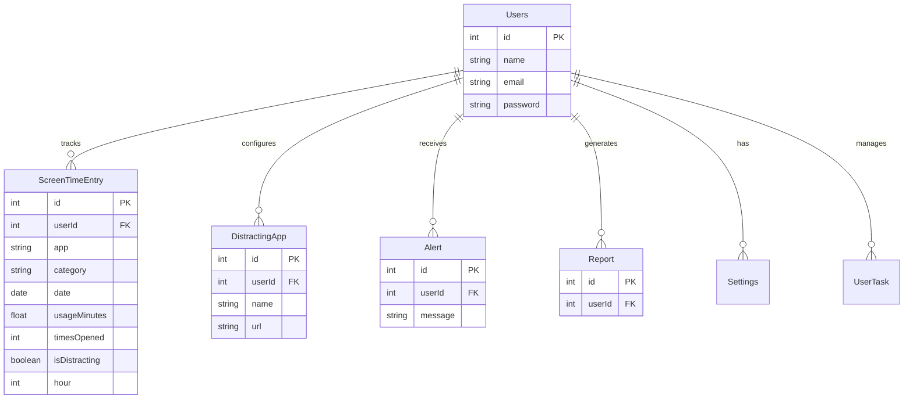
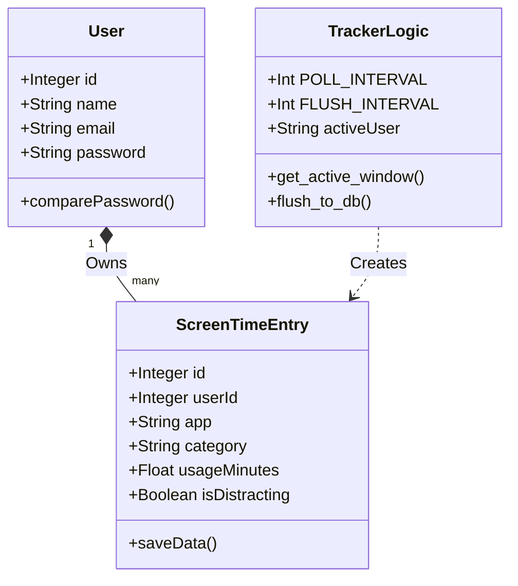
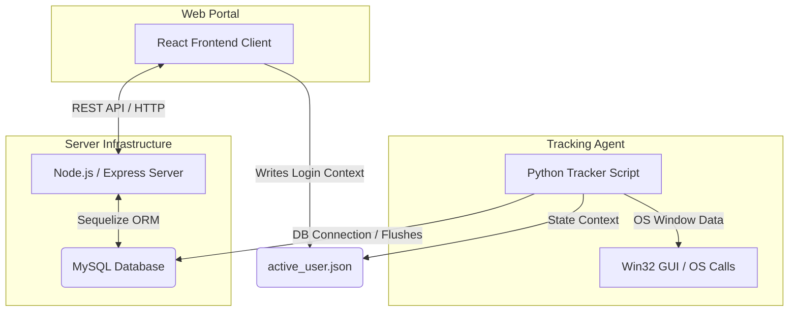
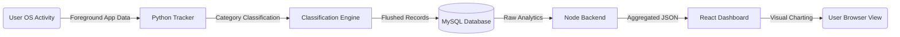
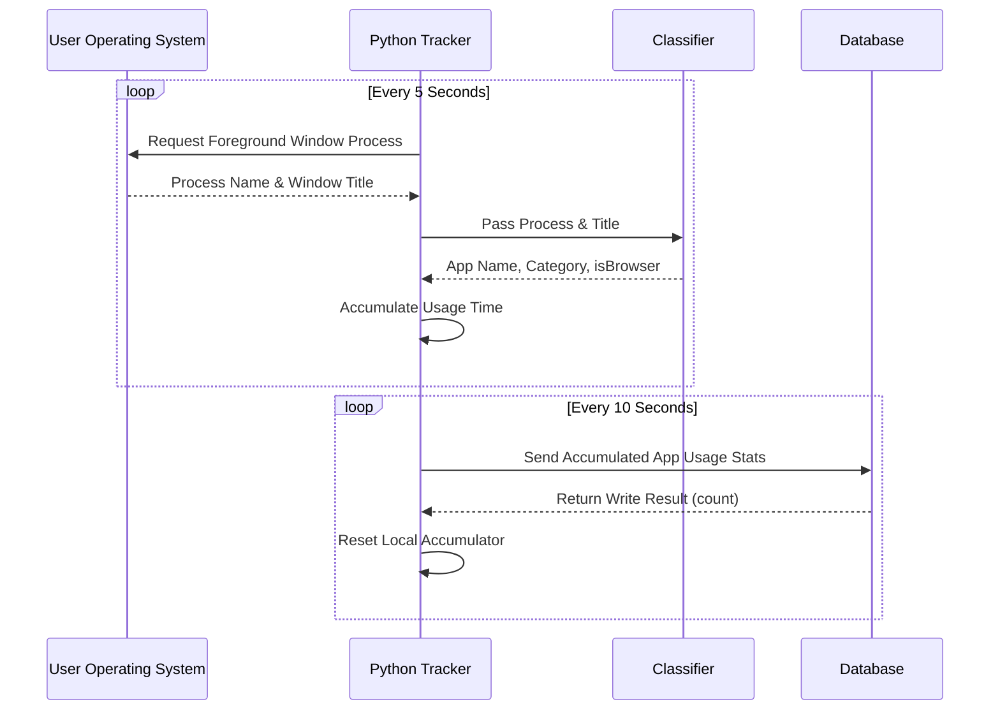
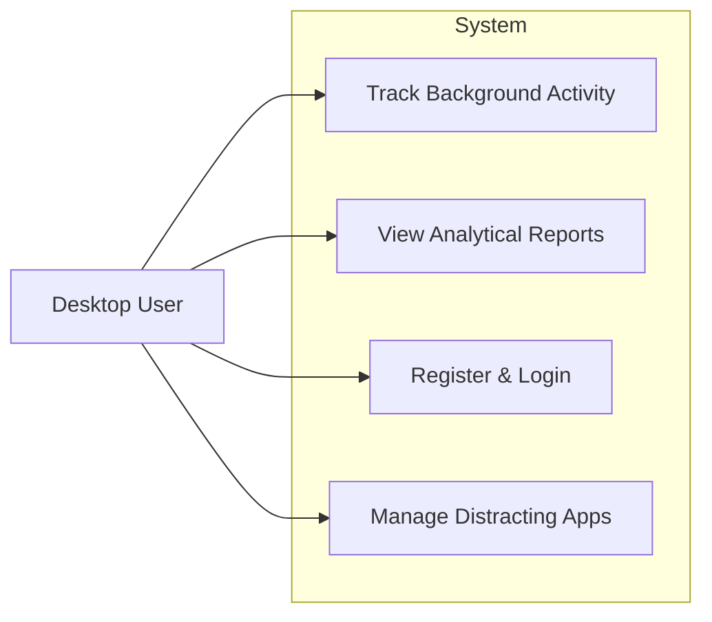

# ScreenTimeAnalyzer (AttenTrack) - Project Documentation

## 1. Application
**Architecture Highlights**
- **Microservices**: Null (The system employs a monolithic backend API and a coupled React frontend, with a dedicated client-side Python tracking script.)
- **Event-Driven**: Null (The architecture is primarily polling-based; the tracker polls active windows and flushes state.)
- **Serverless**: Null (The application is hosted on a traditional Node.js/Express server paired with a MySQL database.)

## 2. Database

### ER Diagram

### Schema Design
Data is handled through Sequelize ORM over a MySQL Database. The primary tables include:
- `Users`: Handles user authentication and identity (`id`, `name`, `email`, `password`).
- `ScreenTimeEntry`: Core analytical records (`id`, `userId`, `app`, `category`, `date`, `usageMinutes`, `isDistracting`, `hour`).
- `DistractingApp`: User-specific list of unproductive sites (`id`, `userId`, `name`, `url`).
- `Alert`, `Report`, `Settings`, `UserTask`: Supportive tables managing application state per user.

### Data Exchange Contract
1. **Frequency of data exchanges**: 
   - Polling occurs every **5 seconds** locally.
   - Batch data flushes to the database every **10 seconds**.
2. **Data Sets**: 
   - Application usage logs containing: `{'app': String, 'category': String, 'usage_seconds': Int, 'is_browser_site': Boolean, 'times_opened': Int, 'hour': Int}`.
3. **Mode of Exchanges**: 
   - **Database Insertion**: Direct database connection from the Python client (`db_writer.py`).
   - **API**: Standard RESTful API (Express.js) for Web Portal CRUD operations.
   - **Queue**: Null.
   - **File**: Null (except for local `active_user.json` reading to pass user context securely).

## 3. Product Goal
To provide users with actionable insights into their digital wellbeing by tracking screen time across desktop applications and browser tabs. It helps identify distracting habits and promotes better productivity management.

## 4. Demography (Users, Location)
- **Users**: Students, professionals, freelancers, and individuals wishing to optimize their screen time or limit digital distractions.
- **Location**: Global/Agnostic. Can be deployed or run locally anywhere.

## 5. Business Processes
1. **User Onboarding**: Users register and authenticate via the web portal.
2. **Context Passing**: The server writes a local token/state (`active_user.json`) containing the logged-in user context.
3. **Tracking**: The user runs the Python `tracker.py` script. The script automatically detects the active user or takes them via CLI arguments.
4. **Data Accumulation**: The script polls the OS every 5 seconds for the active window and classifies the app/website into categories.
5. **Data Storage**: Metrics are dynamically flushed to the backend database every 10 seconds.
6. **Analytics & Review**: Users log into the React web application to view graphical reports and manage configurations.

## 6. Features
- **Auto App Classification**: Groups usage into Work, Entertainment, Social, etc.
- **Background Desktop Tracking**: Monitors all active Windows natively.
- **Distraction Flagging**: Identifies when a user enters non-productive applications.
- **Analytics Dashboard**: Rich UI charting screen time progression.
- **User Authentication**: Secure Login/Registration capability.

## 7. Authorization Matrix
- **User**: Full Read/Write access to their own tracker records, configurations, reports, and alerts.
- **Admin**: Null (No explicit admin panel is maintained in the current iteration).

## 8. Assumptions
- The Python tracking script is executed on a Windows operating system (due to `win32gui` API dependencies), with fallbacks for basic operation.
- Users have local execution rights to run the Python tracking service.
- Device monitoring is restricted to the specific physical machine the script is run on.

---

## Technical Diagrams

### Class Diagram (System Data Models)

### Component Diagram

### Dataflow Diagram (Level 1)

### Sequence Diagram (Tracking Process)

### Use Case Diagram

